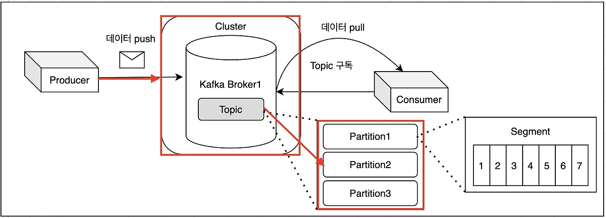

# ✅ Kafka의 정의와 특징

## 🔹 Kafka란?
Kafka는 대용량의 데이터를 빠르고 안정적으로 처리할 수 있는 **분산 메시지 스트리밍 플랫폼**입니다.  
주로 **데이터 파이프라인, 로그 수집, 실시간 스트리밍 처리**에 활용됩니다.

---

## 🔸 Kafka의 주요 특징

### 1. 메시지 브로커 역할
Kafka는 생산자(Producer)와 소비자(Consumer) 사이에서 메시지를 중개하는 **메시지 브로커**로 작동합니다.

- **디커플링(Decoupling)**: 생산자와 소비자가 직접 연결되지 않고, 서로 독립적으로 동작할 수 있도록 도와줌
- **컴포넌트 유연성**: 시스템 간 결합도가 낮아지고, 서비스 확장 및 유지보수가 쉬워짐
- **재사용성**: 메시지 소비 로직을 다양한 시스템에서 재사용 가능
- **확장성**: 생산자/소비자 각각 독립적으로 확장 가능하여 트래픽 증가에도 유연하게 대응 가능

### 2. 비동기 처리 & Pub/Sub 모델
Kafka는 **Pub/Sub(발행/구독) 모델**을 기반으로 비동기 메시징을 지원합니다.

- **생산자와 소비자의 시간적 독립성** → 생산자는 메시지를 보내면 끝, 소비자는 나중에 처리 가능
- **가용성 독립성** → 소비자가 꺼져 있어도 메시지는 브로커에 저장됨
- **병렬 처리** → 소비자 그룹이 메시지를 병렬로 처리 가능
- **고처리량 & 낮은 지연시간** → 실시간 처리가 필요한 환경에 적합

### 3. 고가용성 & 장애 복구

Kafka는 메시지를 여러 브로커에 **복제**하여 저장합니다.  
각 파티션은 **리더(Leader)**와 **팔로워(Follower)** 구조로 동작합니다.

- 브로커 장애 발생 시 → 다른 브로커가 자동으로 리더를 승계
- 데이터 유실 없이 안정적 운영 가능

### 4. 분산 시스템 아키텍처
Kafka는 데이터를 여러 브로커에 분산 저장 및 처리합니다.

- 대규모 데이터 처리에 적합
- 뛰어난 수평 확장성 제공
- 일부 노드 장애에도 전체 서비스 유지

---

## ✅ Kafka의 구성 요소 이해
Kafka는 아래 **구성요소**들로 이루어져 있습니다:

1. **Cluster**
    - Kafka 클러스터는 여러 대의 브로커로 구성되며, 전체 메시지 처리와 저장을 담당

2. **Broker**
    - Kafka의 개별 서버 단위
    - 데이터를 저장하고, 프로듀서와 컨슈머의 요청을 처리
    - 파티션 단위 데이터 관리, 복제, 리더-팔로워 구조로 고가용성 유지

3. **Topic**
    - 메시지를 구분하는 카테고리 단위
    - 프로듀서가 메시지를 보내는 대상이며, 컨슈머는 토픽을 구독하여 메시지를 수신

4. **Partition**
    - 하나의 토픽은 여러 파티션으로 분할될 수 있음
    - 파티션 단위로 데이터 저장 및 병렬 처리 가능
    - 파티션 내 메시지는 순차적으로 저장되어 **순서 보장**

5. **Segment**
    - 파티션 내부 데이터를 저장하는 물리적 파일 단위
    - 일정 크기 또는 시간 기준으로 분리되어 저장
    - 로그 압축, 삭제 등 데이터 정리에 활용

---

## ✅ Producer & Consumer 동작 원리

### 🔹 Producer
- Kafka에 메시지를 생성하고 전송하는 클라이언트
- 특정 토픽, 파티션에 데이터 전송
- 배치 전송, 압축, 재시도 등으로 전송 성능 최적화

### 🔹 Consumer
- Kafka에서 메시지를 읽어오는 클라이언트
- 하나 이상의 파티션에서 메시지를 가져와 처리
- **Consumer Group**을 구성하여 메시지를 병렬로 처리 → 시스템 효율 향상

---

## ✅ 정리
Kafka는 다음과 같은 특징 덕분에 **대규모 데이터 스트리밍**에 적합한 시스템입니다:

- 초당 수백만 건의 데이터를 처리할 수 있는 **고성능**
- 순차적 디스크 기록 방식과 최적화 기법 덕분에 **빠르고 안정적인 처리** 가능
- **수평 확장성** 뛰어남 → 브로커, 파티션 추가로 손쉬운 확장
- **내결함성** 제공 → 데이터 복제 및 장애 복구 가능
- **실시간 데이터 처리**에 최적화 → 로그 수집, 모니터링, 이벤트 기반 시스템 등 활용

따라서, Kafka는 **대용량 시스템**에서 **데이터 스트리밍과 이벤트 중심 아키텍처**의 핵심 인프라로 널리 사용되고 있습니다.
