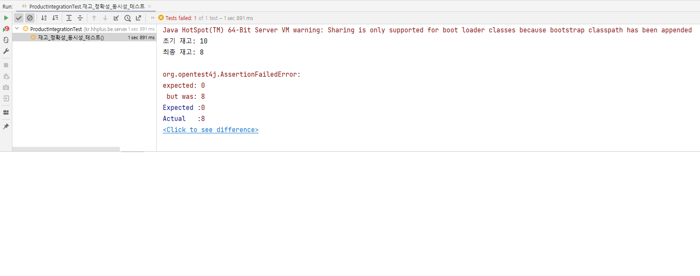
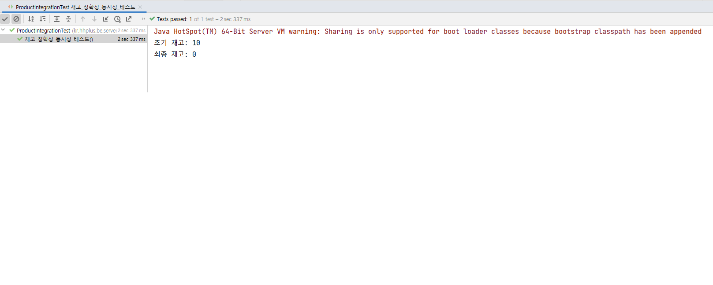
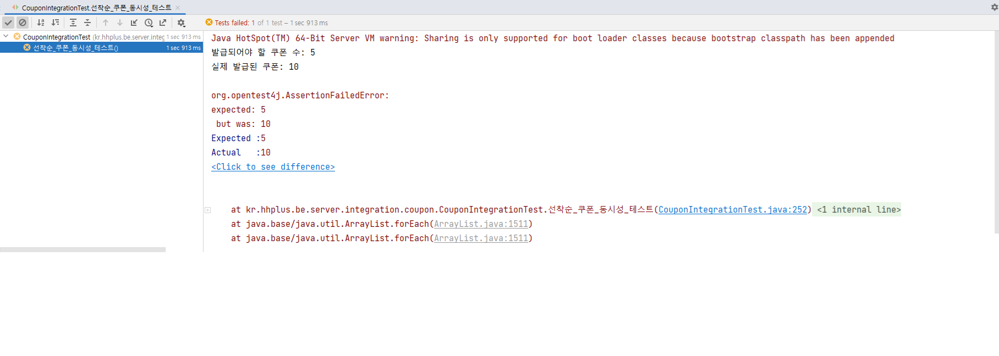
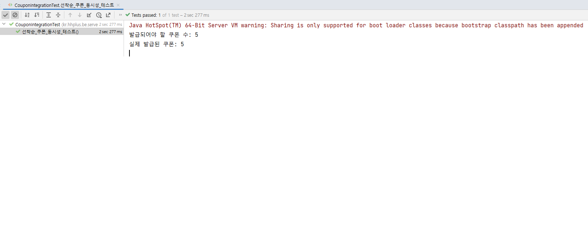
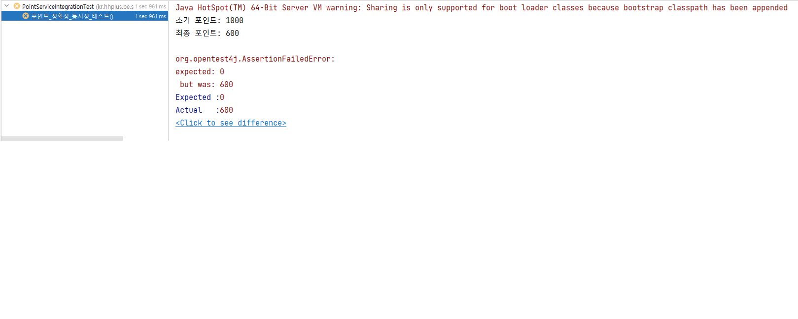
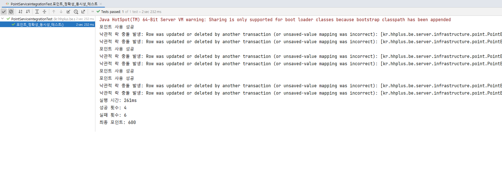

# e-커머스 시스템 동시성 제어 보고서

e-커머스 시스템에서 동시성 문제는 매우 흔하며, 주로 여러 사용자가 동시에 같은 자원(재고, 쿠폰 등)을 접근하거나 수정할 때 발생합니다.

## 1. 발생할 수 있는 동시성 문제

-재고 초과 판매 : 여러 사용자가 동시에 같은 상품을 구매하면서 재고 수량보다 많이 팔리는 현상

-선착순 쿠폰 발급 : 여러 사용자가 동시에 선착순 쿠폰을 발급하면서, 쿠폰 수량보다 많이 발급되는 현상

-포인트 중복 사용 : 포인트가 중복으로 차감되거나 여러 번 사용되는 문제

## 2. 낙관적 락 (Optimistic Lock) VS 비관적 락 (Pessimistic Lock)

### 2-1. 낙관적 락 선택 기준
- **낮은 충돌 확률**: 동시 수정이 드문 자원
- **성능 우선**: 높은 처리량과 응답 속도 요구
- **재시도 가능**: 충돌 시 재시도로 해결 가능한 상황
- **확장성 고려**: 시스템 규모 확장 시 성능 유지 필요

### 2-2. 비관적 락 선택 기준
- **높은 경쟁 상황**: 동시 접근이 빈번한 자원
- **데이터 정합성 우선**: 비즈니스 로직 위반 시 치명적 손실
- **즉시성 요구**: 실시간으로 정확한 상태 확인 필요
- **예측 가능한 충돌**: 충돌 발생이 확실한 상황

## 3. 기능별 제어 방식 결정 및 사유

### 3-1. 재고 차감 처리 - 비관적 락 (PESSIMISTIC_WRITE)

**결정 사유:**
- **높은 경쟁 상황**: 인기 상품의 경우 동시에 많은 사용자가 구매를 시도
- **데이터 정합성의 중요성**: 재고 초과 판매는 비즈니스에 치명적인 손실
- **즉시성 요구**: 재고 부족 시 즉시 판매 중단이 필요

**적용 방식:**
- 상품 조회 시 `SELECT ... FOR UPDATE`로 배타적 잠금
- 다른 트랜잭션의 읽기/쓰기 모두 차단

### 3-2. 선착순 쿠폰 발급 - 비관적 락 (PESSIMISTIC_WRITE)

**결정 사유:**
- **극도의 경쟁 상황**: 선착순 쿠폰은 발급 시작과 동시에 폭주
- **정확한 수량 제한**: 쿠폰 수량 초과 발급은 서비스 신뢰도 저하

**적용 방식:**
- 쿠폰 정책 조회 시 `SELECT ... FOR UPDATE`로 배타적 잠금
- 발급 수량 확인과 증가를 원자적 연산으로 처리
- 동시 발급 시도 시 순차적 처리로 공정성 보장

### 3-3. 유저 포인트 관리 - 낙관적 락 (@Version)

**결정 사유:**
- **낮은 충돌 확률**: 개인별 포인트는 동시 사용 빈도가 상대적으로 낮음
- **성능 우선**: 포인트 사용은 사용자 경험에 직접적 영향
- **재시도 가능**: 충돌 발생 시 재시도로 충분한 처리 가능

**적용 방식:**
- 포인트 엔터티에 `@Version` 필드 추가
- 업데이트 시 버전 비교로 동시성 검증
- 충돌 발생 시 `ObjectOptimisticLockingFailureException` 처리

## 4. 테스트 결과

### 4-1.  재고 

#### 실패하는 테스트 (락 미적용)

- 초기 재고 10개에 대해 10개 스레드가 각각 2개씩 차감 시도
- 결과: 재고가 정확히 차감되지 않음 (동시성 문제 발생)

#### 성공하는 테스트 (비관적 락 적용)

- 비관적 락 적용 후 재고가 정확히 차감됨
- 동시성 문제 해결 확인

### 4-2. 선착순 쿠폰

#### 실패하는 테스트 (락 미적용)

- 최대 5개 쿠폰 정책에 대해 10개 스레드로 동시 발급 시도
- 결과: 5개 초과 발급됨 (동시성 문제 발생)

#### 성공하는 테스트 (비관적 락 적용)

- 비관적 락 적용 후 정확히 5개만 발급됨
- 동시성 문제 해결 확인

### 4-3. 포인트

#### 실패하는 테스트 (락 미적용)

- 초기 포인트 1000에 대해 10개 스레드가 각각 100씩 사용 시도
- 결과: 포인트가 부정확하게 차감됨 (동시성 문제 발생)

#### 성공하는 테스트 (낙관적 락 적용)

- 낙관적 락 적용 후 포인트가 정확히 차감됨
- 동시성 문제 해결 확인

