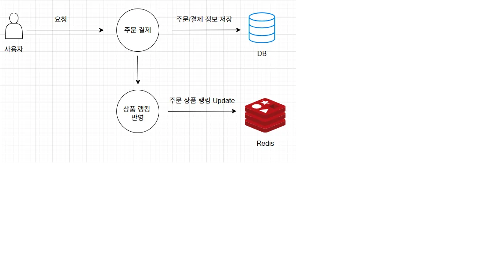

# �� 보고서 - Redis 기반 상품 랭킹 시스템

## 1. 목적
- 기존에는 인기 상품 조회 기능이 없었습니다.
- 인기 상품 랭킹을 조회하는 기능이 필요해지게 되었습니다.

## 2. 설계

### 2-1) 요구사항
- **Sorted Set(ZSET) 사용, 판매량 상위 n개 제품 조회**
- **Spring Event Handler**
- **Redis Sorted Set을 활용하여 '판매량'을 기준으로 호출**
- **Redis Atomicity**: Redisson 파이프라인 사용

### 2-2) 데이터 흐름

### 2-3) 이벤트 발행 및 처리 구현
  - 주문 완료 시점에 즉시 이벤트 발행
  - 비동기 이벤트 핸들러로 실시간 처리
  - 더 단순하고 효율적인 구조

## 3. 성과

### 3-1) 구현 완료된 기능
- ✅ **실시간 랭킹 업데이트**: 주문 완료 즉시 Redis에 반영
- ✅ **인기 상품 조회**: 판매량 기준 TOP 10 상품 제공
- ✅ **개별 상품 랭킹**: 특정 상품의 순위 및 판매량 조회
- ✅ **Redis 파이프라인**: 배치 처리로 성능 최적화
- ✅ **Spring Events**: 비동기 처리로 응답 시간 단축

### 3-2) API 엔드포인트
- `GET /api/products/ranking/top` - 인기 상품 TOP 10 조회
- `GET /api/products/{productId}/ranking` - 개별 상품 랭킹 정보 조회

## 4. Sorted Set 사용

### 4-1) Redis 키 구조
- **키**: `product:ranking:sales`
- **데이터 타입**: Sorted Set (ZSET)
- **구조**: 상품ID를 member로, 판매량을 score로 저장

### 4-2) 데이터 저장 방식
- **ZINCRBY 명령어 사용**: 상품 주문 시 판매량 원자적 증가
- **예시**: `ZINCRBY product:ranking:sales 5 1` (상품1번, 판매량 5 증가)

### 4-3) 랭킹 조회 방식
- **TOP N 조회**: `ZREVRANGE product:ranking:sales 0 9` (상위 10개)
- **개별 점수**: `ZSCORE product:ranking:sales 1` (상품1번 점수)
- **개별 순위**: `ZRANK product:ranking:sales 1` (상품1번 순위)

## 5. 기대효과

### 5-1) 실시간성 향상
주문 완료 즉시 랭킹 반영, 실시간 인기 상품 정보 제공

### 5-2) 사용자 경험 개선
- **즉시성**: 주문 후 바로 랭킹에 반영되어 사용자 만족도 향상
- **정확성**: Redis Sorted Set을 통한 정확한 순위 계산
- **성능**: Redis의 고성능 조회로 빠른 응답 시간

### 5-3) 시스템 확장성
- **이벤트 기반**: 컴포넌트 간 결합도 낮음, 새로운 기능 추가 용이
- **비동기 처리**: 주문 처리와 랭킹 업데이트 분리로 시스템 안정성 향상
- **Redis 활용**: 수평적 확장 가능한 인프라 구조

---

